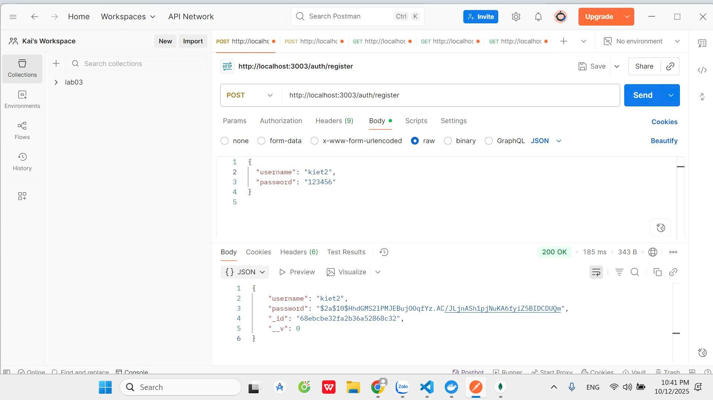
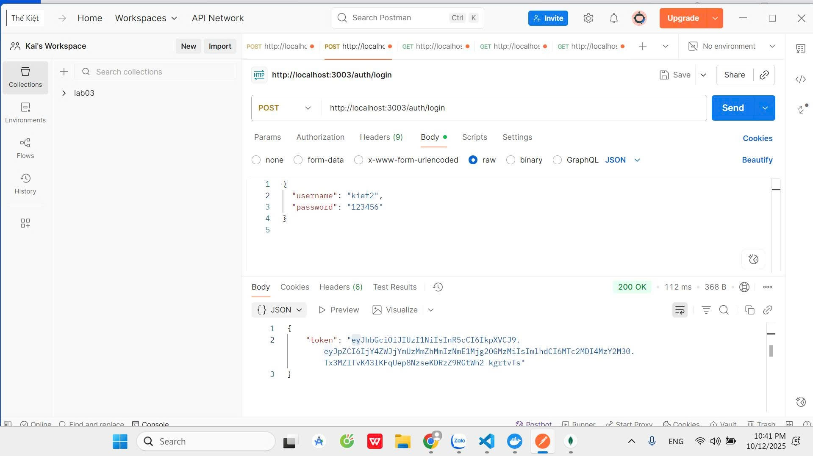
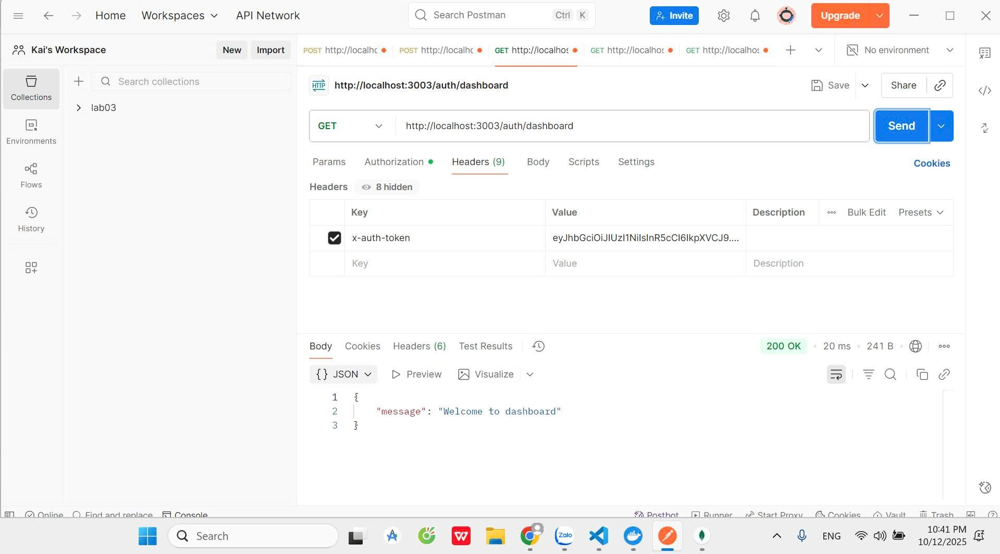
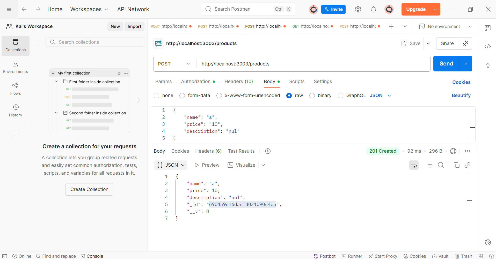
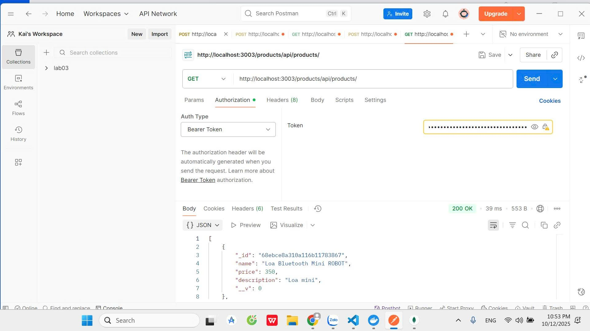
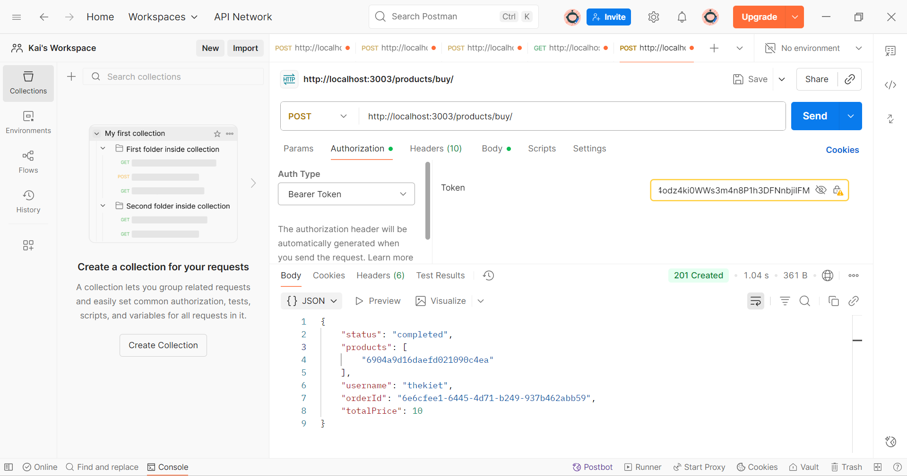
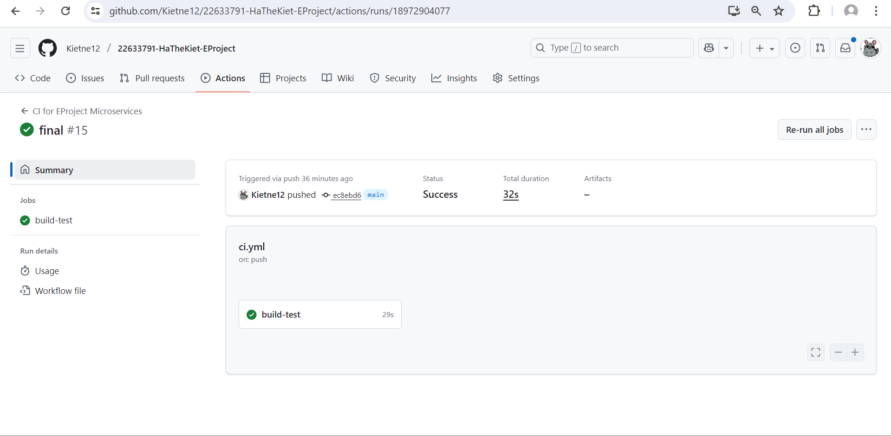

# 22633791-HaTheKiet-EProject

## Tổng Quan Dự Án

Dự án là **hệ thống thương mại điện tử backend** được xây dựng theo **kiến trúc microservices** với cơ chế giao tiếp **bất đồng bộ** giữa các dịch vụ. Hệ thống bao gồm các dịch vụ chính:

- **Dịch vụ Auth**: Quản lý xác thực và phân quyền người dùng.  
- **Dịch vụ Product**: Quản lý thông tin sản phẩm, tồn kho, giá cả; cung cấp API để tạo, sửa, xóa và truy xuất sản phẩm.  
- **Dịch vụ Order**: Xử lý quy trình đặt hàng, theo dõi trạng thái đơn hàng, tính tổng giá trị, và giao tiếp với Product Service.  

### Kiến trúc & Giao tiếp

- Các microservices giao tiếp **bất đồng bộ** thông qua **RabbitMQ (AMQP)**:
  - **Producer**: Gửi tin nhắn vào hàng đợi.  
  - **Queue**: Lưu trữ tạm thời các tin nhắn.  
  - **Consumer**: Lắng nghe và xử lý tin nhắn từ hàng đợi.  

- Cơ chế này đảm bảo **đáng tin cậy, theo sự kiện, và dễ mở rộng**.  

- **API Gateway** là điểm truy cập tập trung, xử lý **định tuyến, chuyển đổi giao thức, xác thực, giới hạn truy cập và caching**.

---

## Test all business logic with POSTMAN

### 1. Register
**POST** `http://localhost:3003/auth/register`  

### 2. Login
**POST** `http://localhost:3003/auth/login`  

### 3. Dashboard
**GET** `http://localhost:3003/auth/dashboard`  

### 4. Create Product
**POST** `http://localhost:3003/products`  

### 5. Get Product
**GET** `http://localhost:3003/products/api/products/`  

### 6. Order Product
**POST** `http://localhost:3003/products/buy`  

### 7. Github Action: Thực hiện CI/CD 
